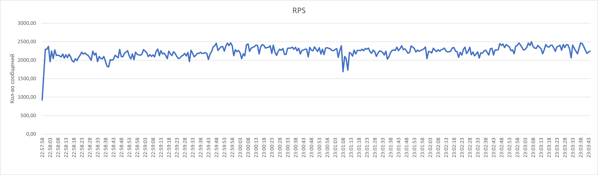

# spring-yoomoney-db-queue
## Тема: Исследование влияния различных параметров таблиц в работе с очередями сообщений на основе базы данных

## Задачи
### Цель исследования
Целью данного научно-исследовательской работы является изучение влияния различных параметров таблиц в работе с очередями сообщений на основе базы данных. 

Основной акцент будет сделан на оптимизации эффективности и пропускной способности системы, исследуя воздействие различных факторов на данную работу.

### Задачи и этапы исследования
1. Разработка библиотеки для взаимодействия с базой данных в качестве брокера сообщений.
2. Подготовка базы данных для проведения экспериментов.
3. Проектирование и реализация двух сервисов - Producer и Consumer, обеспечивающих передачу и прием данных через брокера сообщений.
4. Оптимизация базы данных
5. Тестирование различных параметров таблицы и их влияния на эффективность системы.

## Результаты
Достижение высокой пропускной способности
Для достижения высокой пропускной способности потребовались изменения на 3 уровнях:
1. База данных
    * Партиционирование таблицы для работы с ней как с очередью сообщений
        > Было выполнено секционирование по хешу id сообщения.
    * Индексация полей таблицы для ускорения процесса чтения данных
        > Для индекса были выбраны поля по которым производится фильтрация данных при запросе на чтение, а именно queue_name, next_process_at, id с применением алгоритма индексации - btree.
2. Приложение
   * Оптимизация способов передачи и получения данных
        > Для составления запроса на чтение используется Common Table Expression (CTE) так как такие запросы дополнительно оптимизируются при выполнении. Также чтение батчами по несколько сообщений позволило значительно ускорить извлечение данных из очереди.
   * Многопоточный Consumer
        > Реализовал параллельную обработку данных на уровне приложения, что позволило увеличить объём обрабатываемых данных.
3. Масштабирование
   >    Чтобы обеспечить высокую пропускную способность было развернуто несколько инстансев producer и consumer, что позволило обеспечить достаточную загрузку очереди и кол-во одновременно обрабатываемых сообщений

Пропускная способность очереди была успешно достигнута и даже превзошла - **2300 RPS**.
### Преимущества и недостатки подхода
Преимущества:
* Низкая стоимость масштабирования.
* Удобство в случаях если требуется обрабатывать слишком долгие процессы и в очереди может быть накопленной много данных.
* Удобство настройки благодаря spring-boot-starter-db-queue.
* Гибкая платформа для реализации разных способов взаимодействия с очередью сообщений.

Недостатки:
* Является антипаттерном в большинстве случаев.
* Наличие скоростных ограничений.
* Наличие сложности организации совместной работы нескольких сервисов.
### Анализ результатов тестирования
Результаты тестирования показали стабильную работу системы при максимальной нагрузке.
Показатели нагрузки в течение тестирования  и анализ метрик позволяют сделать выводы о эффективности и устойчивости разработанного подхода.

  

Рисунок 1. Задержка (min/avg/max)

  

Рисунок 2. Кол-во запросов в секунду

### Выводы и дальнейшие перспективы
Разработанный подход нашел успешное применение для решения задачи обработки сообщений с высокой нагрузкой, однако во многих случаях этого недостаточно. Тем не менее использование такого подхода по-прежнему распространено для решения ряда специфических задач.
Дальнейшие исследования будут включать в себя эксперименты с настройками базы данных, конфигураций consumer/producer и масштабированием.

## Технологии
* Spring-Boot 3
* Java 21
* PostgreSQL
* [db-queue](https://github.com/db-queue/db-queue)

## Статус
Проект _закончен_

## Цель
Проект сделан в образовательных целях

## Контакты
Выполнен [Гурьяновым Марком](https://mark1708.github.io/) под чутким руководством [kartzum](https://github.com/kartzum)
#### +7(962)024-50-04 | mark1708.work@gmail.com | [github](http://github.com/Mark1708)

