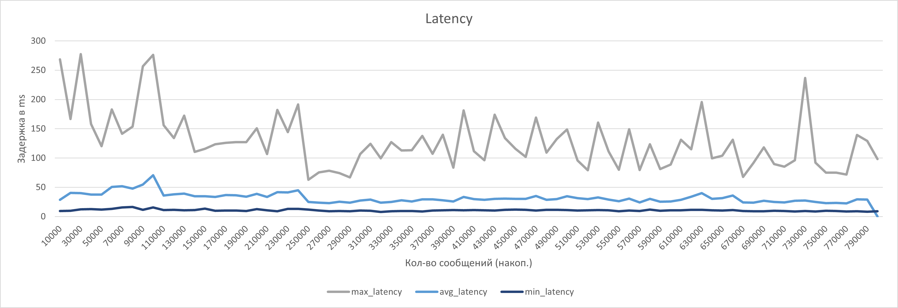
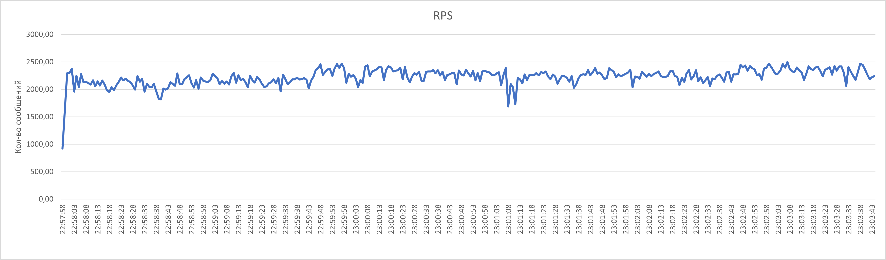

# spring-yoomoney-db-queue

[English version](README.md)


Бенчмарк очереди на PostgreSQL: сравнение схем таблиц, пакетной обработки и партиционирования в системе из Spring Boot producer/consumer сервисов.

## На какой вопрос отвечает репозиторий

Эксперимент проверяет практический backend-вопрос: если сервис уже использует PostgreSQL, насколько далеко можно зайти с очередью поверх PostgreSQL до момента, когда отдельный брокер становится очевидно лучшим выбором?

В репозитории сохранены:

- небольшая локальная реализация `db-queue`;
- Spring Boot starter для этой очереди;
- producer и consumer сервисы;
- небольшой стенд для запуска бенчмарка;
- SQL-варианты таблиц для разных схем очереди;
- сохранённые графики и презентация с результатами.

Это журнал эксперимента и запускаемый demo-стенд, а не рекомендация заменять RabbitMQ, Kafka или другой брокер PostgreSQL-очередью в новых high-load системах.

## Кратко

| Поле | Значение |
| --- | --- |
| Тип репозитория | Backend-бенчмарк / сохранённый исследовательский срез |
| Runtime-среда | Java 21 |
| Framework | Spring Boot 3.2.2 |
| Сборка | Gradle multi-project build |
| Хранилище | PostgreSQL |
| Телеметрия бенчмарка | RabbitMQ + отдельная БД для `test-app` |
| Главный результат | В сохранённой сравнительной таблице лучший вариант — `queue_tasks_5` с batch size `10` |

## Архитектура

```text
test-app
  POST /?testDataCount=N
        |
        v
producer-app
  накапливает 10 сообщений и пишет пакет в db-queue
        |
        v
PostgreSQL-таблица очереди: queue_tasks_1 .. queue_tasks_6
        |
        v
consumer-app
  читает очередь с batch-size 10 и thread-count 14
        |
        v
RabbitMQ
  передаёт статистику обработки сообщений
        |
        v
test-app
  сохраняет статистику в test-db и отдаёт её через GET /
```

## Модули

| Модуль | Назначение |
| --- | --- |
| `db-queue` | Локальная Java-реализация очереди, хранящей задачи в PostgreSQL. |
| `spring-boot-starter-db-queue` | Spring Boot auto-configuration для локального модуля очереди. |
| `common` | Общие DTO для сервисов бенчмарка. |
| `producer-app` | HTTP-сервис, который принимает сообщения бенчмарка и пишет их в очередь пакетами по 10 сообщений. |
| `consumer-app` | Worker, который читает задачи из PostgreSQL и отправляет статистику обработки в RabbitMQ. |
| `test-app` | Контроллер бенчмарка: запускает прогоны, вызывает producer-сервисы, записывает статистику и отдаёт сохранённые результаты. |

## Варианты таблиц очереди

`sql/create_tables.sql` определяет шесть таблиц очереди. В сохранённой сравнительной таблице участвуют варианты от `queue_tasks_1` до `queue_tasks_5`; `queue_tasks_6` есть в SQL, но не представлен в сохранённых результатах.

| Вариант | Схема |
| --- | --- |
| `queue_tasks_1` | Базовая таблица. |
| `queue_tasks_2` | Базовая таблица плюс настройки autovacuum и btree index. |
| `queue_tasks_3` | Добавляет `fillfactor = 30` для таблицы и индекса. |
| `queue_tasks_4` | Hash partitioning на 6 partitions. |
| `queue_tasks_5` | Hash partitioning на 8 partitions. |
| `queue_tasks_6` | Hash partitioning на 10 partitions; дополнительный SQL-вариант без строки в сохранённой таблице результатов. |

## Локальный запуск

Compose stack использует готовые images из `ghcr.io/mark1708/*`. Он подходит для запуска сохранённого стенда, но сам по себе не доказывает, что локальный исходный код сейчас собирается.

```sh
cp .env.example .env
docker compose up -d
```

Compose запускает:

| Сервис | Назначение | Local endpoint |
| --- | --- | --- |
| `producer-app` | Пишет сообщения в очередь поверх PostgreSQL | `http://localhost:8070/` |
| `consumer-app` | Читает очередь и отправляет статистику обработки | `http://localhost:8090/` |
| `test-app` | Запускает прогоны и возвращает сохранённые результаты | `http://localhost:8080/` |
| `db-queue` | PostgreSQL database для очереди | `localhost:5432` |
| `test-db` | PostgreSQL database для метрик | `localhost:5433` |
| `rabbit-mq` | RabbitMQ broker и management UI | `localhost:5672`, `http://localhost:15672/` |

Запуск небольшого прогона через стенд:

```sh
curl -X POST 'http://localhost:8080/?testDataCount=10000'
curl http://localhost:8080/
```

По умолчанию compose настраивает producer и consumer на `DB_QUEUE_LOCATION=queue_tasks_1`. Чтобы сравнить другой вариант таблицы, измените эту переменную для обоих сервисов и пересоздайте соответствующие контейнеры. Для честного сравнения нужно сбрасывать PostgreSQL volume или иначе очищать состояние очереди между прогонами.

## Как воспроизвести полное сравнение

В репозитории есть строительные блоки эксперимента, но нет одной команды, которая прогоняет все варианты и заново строит графики. Ручное воспроизведение требует:

1. Запустить PostgreSQL, RabbitMQ, producer, consumer и test-app.
2. Выбрать таблицу очереди через `DB_QUEUE_LOCATION`.
3. Запустить `POST` endpoint в `test-app` с одинаковым числом сообщений для каждого варианта.
4. Забрать сохранённые результаты через `GET /` в `test-app`.
5. Сбросить состояние очереди и test data между вариантами.
6. Вручную пересобрать графики из собранных измерений.

## Сохранённая сравнительная таблица

Ниже — сохранённый срез из документации проекта. Delta считается относительно базовой строки.

| Configuration | Batch | RPS | Delta | Delta % |
| --- | ---: | ---: | ---: | ---: |
| `queue_tasks_1` | 1 | 334,69 | baseline | baseline |
| `queue_tasks_1` | 10 | 1222,82 | 888,12 | 265,35 |
| `queue_tasks_2` | 10 | 1275,85 | 941,15 | 281,20 |
| `queue_tasks_3` | 10 | 1230,76 | 896,06 | 267,73 |
| `queue_tasks_4` | 10 | 1310,81 | 976,11 | 291,64 |
| `queue_tasks_5` | 10 | 1314,12 | 979,42 | 292,63 |
| `queue_tasks_5` | 20 | 1289,58 | 954,88 | 285,30 |

Лучшая строка в этой таблице — `queue_tasks_5` с batch size `10`: hash partitioning на 8 partitions и настроенные параметры хранения.

## Графики и происхождение результатов

В репозитории сохранены три артефакта с результатами:

| Артефакт | Значение |
| --- | --- |
| [`assets/presentation.pdf`](assets/presentation.pdf) | Исходная презентация с методикой, вариантами таблиц, таблицей результатов и выводами. |
| [`assets/latency.png`](assets/latency.png) | График latency с min/avg/max latency по накопленному числу сообщений. |
| [`assets/RPS.png`](assets/RPS.png) | График RPS одного прогона, визуально показывающий throughput в диапазоне 2k+ RPS. |

График RPS — это time-series одного прогона, а сравнительная таблица — агрегированное сравнение разных вариантов. Их нельзя читать как одну и ту же метрику без исходных заметок об измерениях.

<p align="center">
  
</p>
<p align="center">Latency: min / average / max</p>

<p align="center">
  
</p>
<p align="center">Запросы в секунду во время выполнения</p>

## Ограничения

- Benchmark numbers — сохранённые результаты, а не заново полученные измерения.
- Hardware, PostgreSQL settings, состояние контейнеров, dataset size, выбранная таблица и configuration сервисов могут менять результат.
- Compose запускает готовые container images; сборка локального source code — отдельная проверка.
- `queue_tasks_6` есть в SQL, но не имеет строки в сравнительной таблице.
- Result artifacts сохранены вручную; script для regeneration charts не включён.
- Реальные credentials должны оставаться в локальных `.env` files и не попадать в git.

## Ссылки

- Upstream inspiration: [db-queue/db-queue](https://github.com/db-queue/db-queue)
- SQL variants: [`sql/create_tables.sql`](sql/create_tables.sql)
- Benchmark deck: [`assets/presentation.pdf`](assets/presentation.pdf)

## Статус

Backend/research project. Репозиторий сохраняет benchmark context, implementation notes и reproducibility guidance; он не поддерживается как production-ready queue service.
